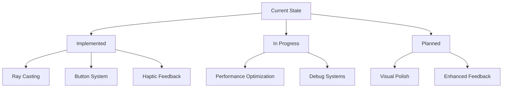

# Active Context

## Current Focus
The 3D campaign menu system is implemented with core functionality for voyage selection. Current focus is on refinement and optimization of the VR interaction system.

## Recent Changes
1. Basic implementation complete:
   - VR environment setup
   - Controller ray casting
   - Button interaction system
   - Voyage difficulty configuration
   - Scene transition handling

2. Core features implemented:
   - Interactive button system with animations
   - Haptic feedback for interactions
   - Animated map display
   - Difficulty level selection

## Active Considerations

### VR Interaction

### Key Decision Points
1. Button Interaction System
   - Currently uses physical button press animation
   - Considers both left and right controller input
   - Tracks button states via dictionaries

2. Environment Design
   - Cargo container environment provides scale
   - Static meshes for performance
   - Strategic placement of interactive elements

3. Performance Optimization
   - Monitoring frame rates for VR comfort
   - Optimizing collision detection
   - Managing scene complexity

## Immediate Tasks
1. Performance Monitoring
   - Implement detailed performance logging
   - Monitor frame timing
   - Optimize heavy operations

2. Debug Enhancement
   - Expand verbose logging
   - Add visual debug helpers
   - Improve error handling

3. Interaction Polish
   - Refine button press feel
   - Enhance visual feedback
   - Optimize haptic response

## Current Status
- Core functionality: ✓ Implemented
- VR Integration: ✓ Functional
- Performance: 🔄 Under Review
- Debug Systems: 🔄 Expanding
- User Experience: 🔄 Refining

## Next Steps
1. Implement comprehensive performance monitoring
2. Enhance debug visualization system
3. Refine interaction feedback
4. Optimize scene transitions
5. Polish visual elements
