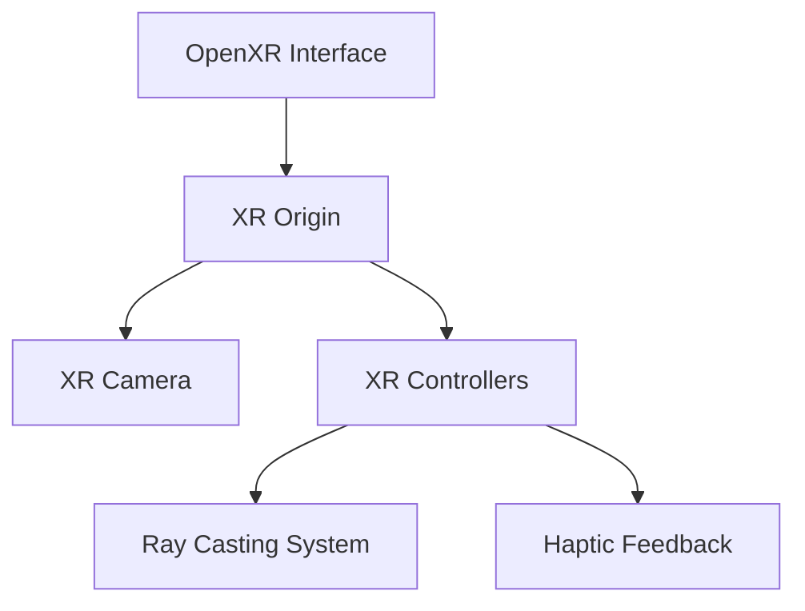
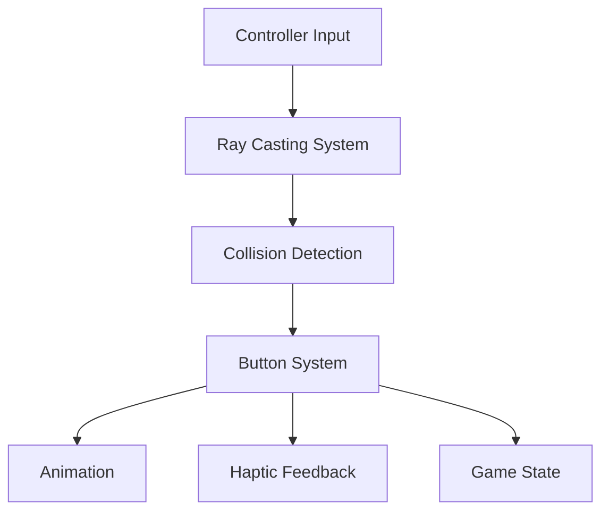
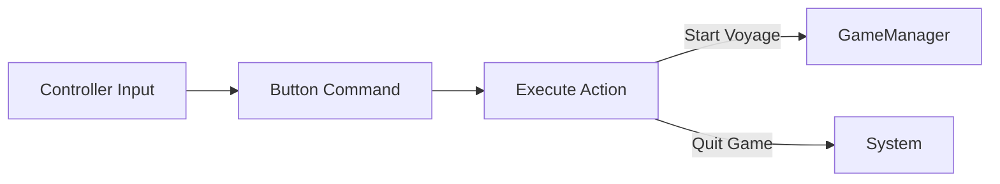
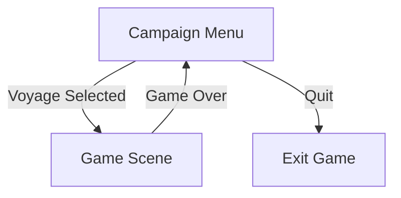
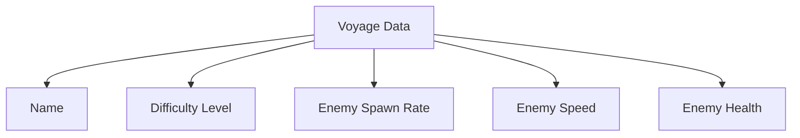

# System Patterns

## Core Architecture

### VR Integration Layer


### Menu Interaction System


## Design Patterns

### Observer Pattern
- Controller events trigger button interactions
- Button states notify animation and haptic systems
- Scene changes notify game manager

### State Management
- Button press states tracked via dictionaries
- Animation states managed through timers
- Scene transition states prevent multiple triggers

### Command Pattern (Button System)


## Key Components

### Button System
- Physical button meshes
- Collision areas for interaction
- Animation system for visual feedback
- Haptic feedback integration

### Ray Casting System
- Visual laser beams
- Collision detection
- Interactive dot visualization
- Separate left/right controller handling

### Scene Management


## Technical Patterns

### Animation Management
- Timer-based animations
- Lerp-based position interpolation
- State tracking for multi-stage animations

### Input Handling
- Controller button mapping
- Ray casting for precise interaction
- Collision group system for categorization

### VR Optimization
- Static environment for performance
- Optimized collision shapes
- Careful mesh instance management

## Data Structures

### Voyage Configuration


### Button State Management
```mermaid
flowchart TD
    ButtonState[Button State] --> Position[Original Position]
    ButtonState --> Animation[Animation Timer]
    ButtonState --> Active[Active Status]
    ButtonState --> Hovering[Hover State]
