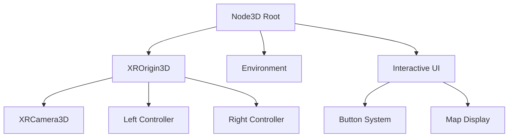
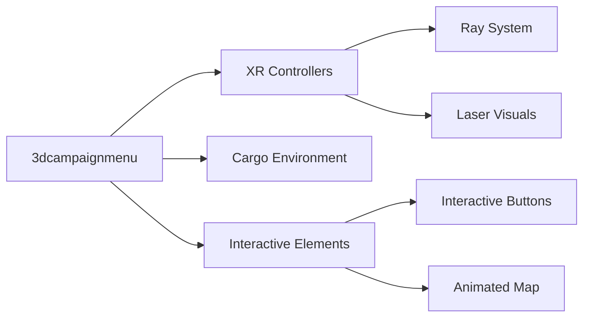

# Technical Context

## Development Environment

### Engine
- Godot 4.x
- OpenXR VR Integration
- GDScript

### VR Setup
- OpenXR as primary VR interface
- Meta Quest 2 controller support
- Haptic feedback system integration
- Room-scale VR configuration

## Key Dependencies

### Scene Components
- `3dcampaignmenu.tscn`: Main campaign menu scene
- `3dcampaignmenu.gd`: Menu logic and VR interaction
- `GameManager`: Global game state management
- Cargo container models and textures
- Animated map display

### Resource Files
```
├── 3dcampaignmenu.tscn     # Main menu scene
├── 3dcampaignmenu.gd       # Menu logic
├── map_camp_1_spritesheet.png  # Map textures
└── Container/
    └── model/
        ├── cargo_container.obj  # Container model
        └── materials/           # Container materials
```

## Technical Constraints

### VR Performance Requirements
- Maintain 90 FPS for VR comfort
- Optimize mesh instances and collisions
- Limit dynamic objects in scene
- Efficient ray casting system

### Scene Structure


### Input System
- OpenXR controller tracking
- Ray-based interaction system
- Button press detection
- Haptic feedback triggers

## Implementation Details

### Scene Components


### Critical Variables
```gdscript
var voyage_data        # Voyage configuration
var button_states     # Button interaction tracking
var ray_system       # Controller ray casting
var vr_setup         # VR environment configuration
```

### Key Methods
- `setup_vr_environment()`: Initialize VR systems
- `update_laser_pointers()`: Handle ray casting
- `press_button()`: Process button interactions
- `update_button_animations()`: Manage visual feedback

## Technical Decisions

### VR Interaction Model
- Ray-based pointing for precise selection
- Physical button press simulation
- Haptic feedback for interaction confirmation
- Separate left/right controller handling

### Performance Optimizations
- Static environment meshes
- Efficient collision shapes
- Minimal dynamic updates
- Optimized button state management

### Debug Support
- Verbose logging system
- Visual debug indicators
- Performance monitoring
- Controller tracking validation
